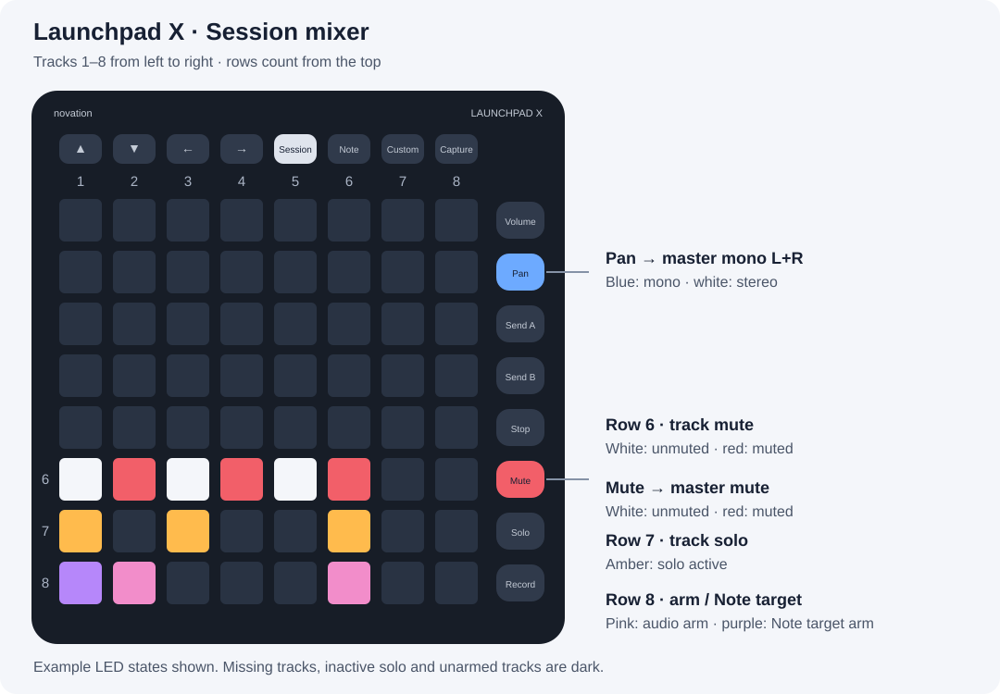

# Launchpad X for REAPER

Dependency-free Lua integration with native Note mode for playing and Session as an eight-track mixer. Columns follow project tracks 1–8, including hidden tracks.

1. Copy the complete `scripts` directory to a permanent location.
2. In REAPER MIDI Preferences, enable Launchpad X **LPX MIDI** for Note input, **LPX DAW** input for control only, and **LPX DAW** output.
3. Load and run **Launchpad X - Install startup.lua** to register actions and preserve existing startup code. Installation works with the device disconnected.
4. Release all pads and run **Enable** (no target is selected automatically). Switch to Session and press row 8 on an instrument track, then return to Note to play.

Ports are discovered automatically; no IDs or saved port configuration are needed. Connect one Launchpad X. Missing or ambiguous ports pause controls and transfers until discovery succeeds. **Configure** reports detected ports and required MIDI preferences.

Row 8 activates a Note target, transfers to another target, or shuts down the active target. Transfers and shutdown wait for notes/sustain to release plus an audio grace period. Press the pending destination or the target awaiting shutdown again to cancel. LEDs show actual arm state during the wait.

An active Note target receives all Note channels with monitoring and record arm enabled. Other direct Launchpad and All MIDI Inputs routes across the project are temporarily suppressed, including tracks beyond column 8; this also blocks other controllers on All MIDI Inputs tracks. Previously armed direct Note routes (including those saved in a reopened project) also disarm when another target activates. Audio-input tracks only toggle arm and leave the Note target unchanged.
